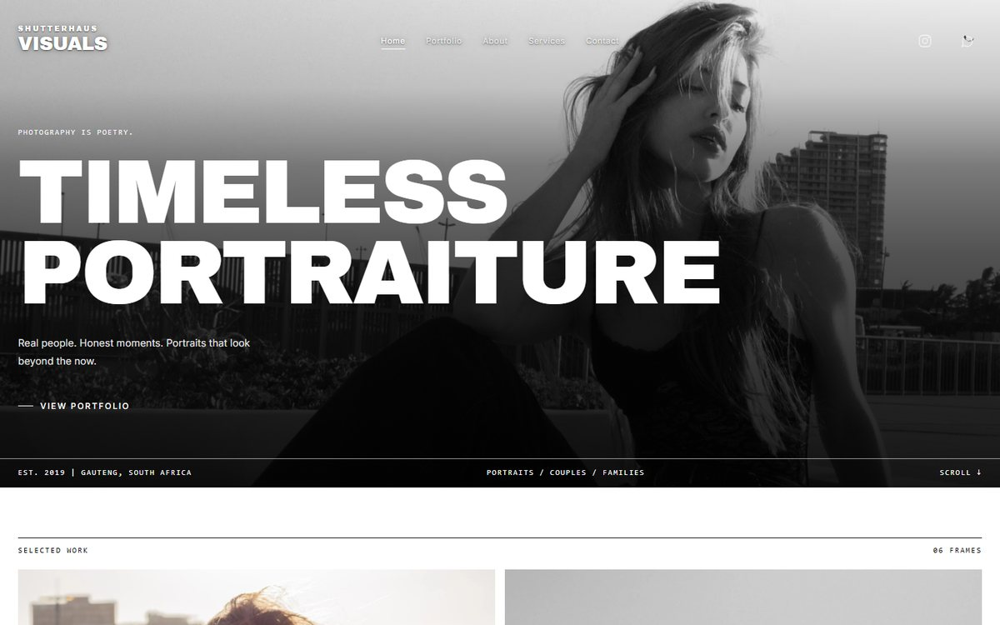
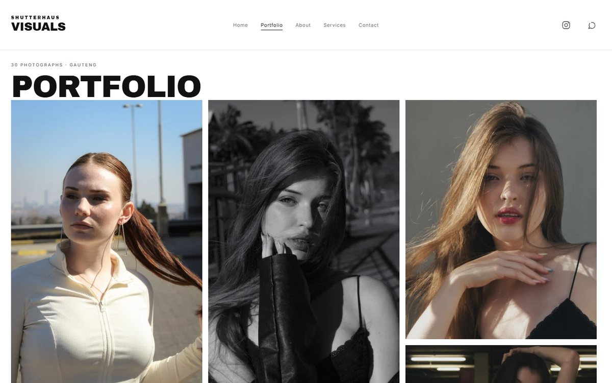
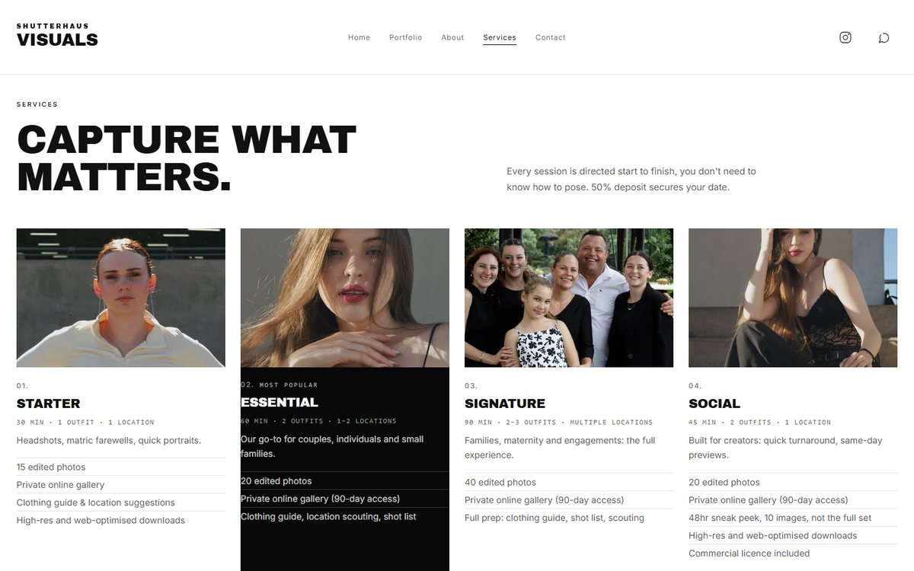
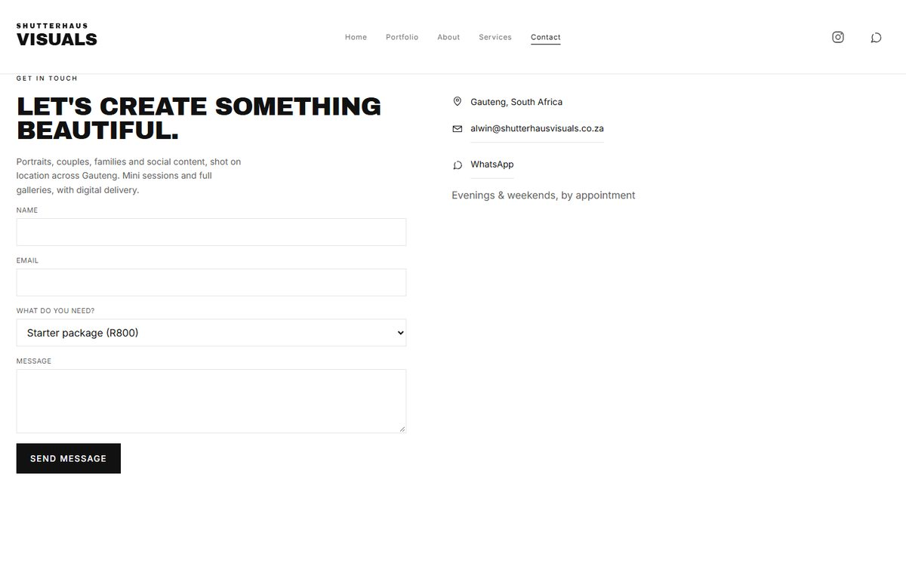
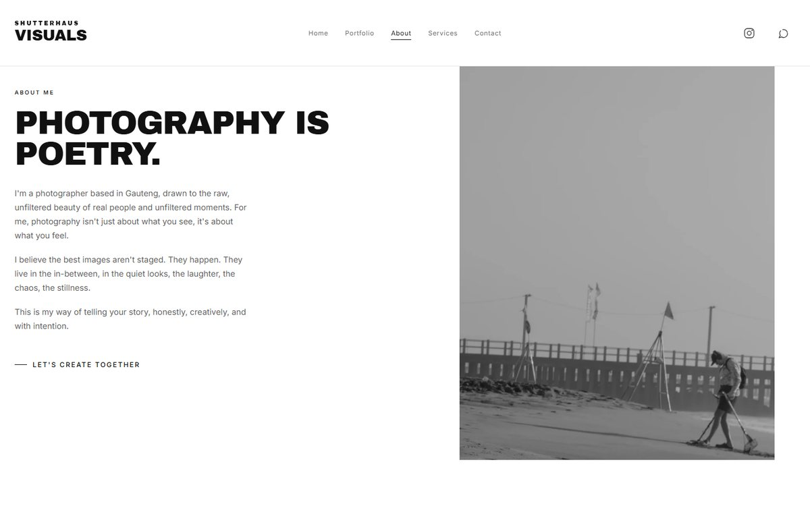
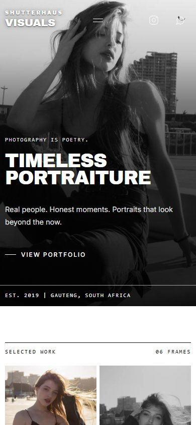

# Shutterhaus Visuals

Portfolio site for **Shutterhaus Visuals**, a Gauteng-based portrait, couples and
family photographer. Static output — Vite + TypeScript, no framework — with a
Google-authenticated admin gallery backed by Supabase.

**Live:** <https://shutterhausvisuals.co.za>

## Screenshots

| Home | Portfolio |
| --- | --- |
|  |  |

| Services | Contact |
| --- | --- |
|  |  |

| About | Home (390px) |
| --- | --- |
|  |  |

---

## Stack

| Piece | What it does |
| --- | --- |
| **Vite 7 + TypeScript** | Build and typecheck. No SPA framework — every route is a real document. |
| **Supabase** | Postgres rows, image Storage, and Google sign-in for the admin. |
| **GitHub Pages** | Hosting, deployed by `.github/workflows/deploy.yml` on every push to `main`. |
| **HostAfrica** | DNS for the custom domain. |

## Run it locally

Requires **Node ≥ 22** and **Python 3** with [Pillow](https://pypi.org/project/Pillow/)
(the build runs the Python page/image tools).

```bash
npm install
cp .env.example .env      # optional — fill in after you create the Supabase project
npm run dev               # builds the pages, then serves at http://localhost:5173
```

It works immediately with placeholder content from `src/demo.ts`. Without a
`.env` the site runs entirely off the demo data and nothing breaks; Supabase is
only needed to upload real work.

```bash
npm run build     # typecheck + generate pages + row/srcset checks + vite build → dist/
npm run preview   # serve the production build at http://127.0.0.1:4173
npm run test      # pricing, enquiry and photo-viewer DOM regressions
npm run verify    # rendered-design gate (see below)
```

`npm run build` chains `tsc --noEmit`, `tools/build-pages.py`,
`tools/check-rows.py`, `tools/check-srcset.py` and `vite build` — a type error,
a broken gallery row or a missing image derivative fails the build.

`npm run verify` renders the built site in headless Chrome and asserts the
design (responsive layout, photograph integrity, gallery geometry and navigation). It needs a Chrome exposing
CDP on port 9222; CI starts one automatically. Locally:

```bash
npm run build
npm run preview &
"/c/Program Files/Google/Chrome/Application/chrome.exe" \
  --headless=new --remote-debugging-port=9222 --user-data-dir=/tmp/chrome-verify about:blank &
node tools/verify.mjs http://127.0.0.1:4173
```

## Package prices and regression checks

`src/pricing.json` supplies Services, Contact, the Home price and generated
search metadata. Package prices are numeric rand amounts, for example `2500`.
Run `npm run build` after editing it. Social includes 40 edited images and a
10-image preview within 48 hours; full galleries arrive in 7–14 days.

`npm run test` checks pricing consistency, Social deliverables, form validation,
draft preservation during rotation, duplicate submission protection, failure
recovery and photo-viewer keyboard focus using a simulated DOM and mocked
requests. `npm run verify` remains the browser layout gate.

## Editorial presentation

`src/makeover.css` owns the public presentation: sentence-case Inter headings,
generous page margins, black booking sections and a subtle recommendation on
Essential. Prices sit beside package names before the photographs. The Archivo
Black wordmark and curated photograph order remain the brand anchors. Services
closes with an enquiry link to Contact. Contact has a separate black panel for
direct contact details. Public copy describes the sessions and booking process.

The Home header stays transparent at the top of the photograph and becomes
solid white while scrolling or opening the mobile menu. The compact menu is
used through 1000px and stays within reach on every page. Home and Portfolio
repack when crossing 760px; height-only
changes never redraw the page, and Contact keeps its form draft during rotation.

Inter 400/500 and Archivo Black 400 are served from `public/fonts/`; their OFL
licenses are included there. The browser gate checks font loading, heading
overflow, aligned desktop prices and the closing enquiry destination, and saves
fresh desktop and phone screenshots for all five public pages. Use
`REVIEW_WIDTHS=320,390,430,768,1024,1440,1920 npm run verify` for the broader
responsive review. The gate also checks menu visibility, dismissal and focus,
Home header behavior, gallery repacking and draft preservation.

## Project layout

```
index.html            home shell          ← generated by tools/build-pages.py
portfolio.html        real document per route (about, services, contact, admin too)
src/
  main.ts             router + wiring
  admin.ts            admin panel UI
  config.ts           brand, nav and contact
  pricing.json        packages, numeric ZAR prices, add-ons and booking terms
  pricing.ts          shared currency formatting
  layout.ts           header / footer chrome, icons
  pages.ts            the column gallery and page bodies
  pages-more.ts       video + contact routes
  supabase.ts         client, Google sign-in, admin allowlist
  store.ts            photo queries, upload, delete
  lightbox.ts         full-size viewer
  demo.ts             placeholder gallery + DEMO_VIDEOS
  styles.css          base design
  editorial.css       the current visual layer (most layout rules)
  makeover.css        public editorial typography, spacing and page refinement
tools/                Python/MJS build + verification tools (see below)
public/               static assets copied verbatim into dist/
  gallery/            the committed photo files + their -<width>w derivatives
  CNAME               custom domain (must match Settings → Pages)
  fonts/              self-hosted Inter / Archivo Black WOFF2 + OFL licenses
  _headers            security headers — only honoured if ever fronted by Cloudflare
  robots.txt, sitemap.xml, 404.html
supabase/
  schema.sql          run once in the SQL editor (table, bucket, RLS)
  composition.sql     example pgvector-backed composition seed
.github/workflows/deploy.yml   CI: build → rendered gate → publish
interleave-order.json the gallery interleave input used by tools/rows.py
```

## Connect Supabase (one-time, ~10 minutes)

Supabase provides the database, image storage and Google sign-in in one place;
the free tier is plenty for a portfolio.

1. Create a project at [supabase.com](https://supabase.com).
2. **SQL Editor → New query** → paste `supabase/schema.sql` → **Run**. This
   creates the `photos` table, the public `photos` bucket, and the Row Level
   Security policies that restrict all writes to your email.
3. **Project Settings → API** → copy the Project URL and the `anon` public key.
4. Copy `.env.example` to `.env` and paste both values in.
5. Restart `npm run dev`.

The `anon` key is safe to commit — it is public by design, and RLS is what
actually protects the data. Never put the `service_role` key in `.env`; it
bypasses RLS.

## Turn on Google sign-in

1. In the [Google Cloud Console](https://console.cloud.google.com/), create a
   project (or pick an existing one).
2. **APIs & Services → Credentials → Create Credentials → OAuth client ID → Web application.**
3. Under *Authorized redirect URIs* add exactly
   `https://YOUR-PROJECT-REF.supabase.co/auth/v1/callback`.
4. Copy the Client ID and Client Secret.
5. Supabase → **Authentication → Providers → Google** → enable, paste both, **Save**.

Only these addresses can sign in *and* pass the database policies — add an admin
to **both**:

- `src/config.ts` → `ADMIN_EMAILS` — the client-side gate.
- `supabase/schema.sql` → `is_admin()` — the real gate, enforced by Postgres.

Editing only the TypeScript list changes who sees the admin screen but grants no
database access.

## Upload photos (admin)

Go to `/admin.html` and sign in with Google. Open **Photo library** to upload, then select photos for Home or Portfolio. Arrange the Page editor, preview the draft, and choose **Publish changes**. Full instructions are in **Photo manager** below.

## Edit the site content

| What | Where |
| --- | --- |
| Wordmark | `src/config.ts` → `nameTop` / `nameBig1` / `nameBig2` |
| Monochrome look on/off | `src/config.ts` → `blackAndWhite` |
| Nav items | `src/config.ts` → `nav` |
| Instagram / WhatsApp links | `src/config.ts` → `social` |
| Email, phone, location, hours | `src/config.ts` → `contact` |
| Contact form endpoint | `src/config.ts` → `contact.formEndpoint` |
| About paragraph | `src/config.ts` → `blurb` |
| Pricing packages | `src/pricing.json` tiers |
| Hero / home strip picks | `src/config.ts` → `heroPhoto`, `homeGalleryCount` (see **Design invariants**) |
| Videos | `src/demo.ts` → `DEMO_VIDEOS` (host the files on Supabase Storage or Cloudinary and paste the URL) |

Leave `contact.formEndpoint` empty and the form opens the visitor's email app;
paste a [Formspree](https://formspree.io) or [Basin](https://usebasin.com)
endpoint and it posts there instead.

## Adding photos to the gallery

Images live in the repository under `public/gallery/` (committed), so adding a
shoot is a git operation rather than a browser upload.

```bash
python tools/add-photos.py "C:/path/to/shoot"            # resize to web JPEGs
python tools/add-photos.py "C:/path/to/shoot" --start 9  # continue numbering
python tools/add-photos.py "C:/path/to/shoot" --dry-run  # don't write

python tools/make-derivatives.py                         # build the -<width>w responsive set
python tools/rows.py                                     # re-curate the portfolio wall
```

- `add-photos.py` resizes to a 1800px longest edge, progressive JPEG q82, applies
  EXIF rotation, refuses files already present, and prints the ready-to-paste git
  command plus the SQL to seed the metadata rows. It never touches the database —
  credentials never sit on disk here.
- `make-derivatives.py` writes the `-400w/560w/800w/1200w/1600w` files the grid
  and `srcset` request. Originals are left intact for the lightbox.
- `rows.py` picks and lays out the portfolio wall (30 frames, 15 rows) from
  `interleave-order.json`. `tools/verify.mjs` and `check-rows.py` assert the
  result.

## Deploy — GitHub Pages

`.github/workflows/deploy.yml` builds on every push to `main` (and on manual
dispatch). The `verify` job runs the rendered-design gate first; the `build` job
then publishes `dist/` through `actions/deploy-pages`. The repo stays **private**
— the Actions deploy path works without a paid Pages plan, unlike the legacy
Pages-for-private-repos route.

The build uses `BASE_PATH: ./` (a **relative** base). Assets then resolve against
the document, so one build serves correctly at both the domain root and the
`github.io` project subpath; an absolute base can only ever be right for one of
them.

### DNS records at HostAfrica — all four A records are required

| Type | Name | Value |
| --- | --- | --- |
| A | `@` | `185.199.108.153` |
| A | `@` | `185.199.109.153` |
| A | `@` | `185.199.110.153` |
| A | `@` | `185.199.111.153` |
| CNAME | `www` | `shutterhausvisuals.co.za` |

The Pages DNS check passes on a single A record (it only needs to resolve), but
**ACME/TLS validation round-robins across all four IPs** — three that do not
answer and the cert request fails with `bad_authz` while the DNS check still
shows green. If a certificate is failing, count the A records first.

`public/CNAME` (two lines: apex + `www`) declares the domain in the published
artifact. With `build_type: workflow` the authoritative copy is **Settings →
Pages**; the two must agree.

### If the certificate gets stuck in `bad_authz`

`bad_authz` does not self-heal and re-saving the domain does not clear it. What
works:

1. Confirm all four A records are present.
2. In **Settings → Pages**, **remove** the custom domain (save blank). That drops
   Pages back to the `github.io` subpath and clears the ACME state.
3. **Re-add** the domain and save.

GitHub then reports **"Certificate Requested"** and retries on its own backoff —
often minutes to an hour. A still-`bad_authz` state straight after the re-add is
normal. An existing valid certificate keeps serving throughout; only the
`http → https` redirect waits. Check with:

```bash
curl -s -o /dev/null -w "code=%{http_code} ssl=%{ssl_verify_result}\n" \
  https://shutterhausvisuals.co.za/
gh api repos/itsnotalwin/shutterhaus-site/pages   # https_certificate.state, https_enforced
```

## Design invariants — do not "tidy" these

Locked decisions that earlier cleanups broke. Change them only by deliberately
reopening the work.

- **Home is pinned.** `heroPhoto` in `src/config.ts` fixes which frame carries the
  hero, and `homeGalleryCount: 6` fixes the home strip in two packed columns on
  desktop and one column at 760px and below. Changing either needs a deliberate home-route pass.
- **Specificity trap.** `.page h1` (0,1,1) beats a bare class such as `.about__h`
  (0,1,0). The `.page` / `.portfolio` prefixes in `editorial.css` are load-bearing,
  not decoration — remove one and a heading's margin collapses to 0.
- **The portfolio wall** is 30 curated frames in three packed columns above
  760px and two below. Phones show the first ten, with a native Show more images
  disclosure for the rest; desktop shows the full wall. `rows.ts` supplies the chosen frames and their order;
  `wallCols()` and the CSS share the breakpoint. Every photo retains its ratio,
  with consistent gutters and no printed frame numbering.
- **Photographs stay as uploaded.** No greyscale or colour filters on either
  touch or hover devices. Gallery and About photographs remain uncropped; the
  hero is a deliberate full-bleed crop. Service thumbnails use natural ratios
  on phones and shared slots on desktop, with landscape groups shown in full.
- **Admin stays out of search.** Keep `/admin` and `/admin.html` disallowed in
  `public/robots.txt`; the admin carries its own `noindex` meta as the real gate.

## Notes

- **Demo vs live photos.** `src/demo.ts` is the fallback; `listPublicPhotos()`
  replaces it only when a live query returns rows — an empty table shows the demo
  grid, not a blank page.
- **Video is demo-only.** The video route renders `DEMO_VIDEOS` and does not read
  from Supabase yet.
- **Routing.** Every route is a real document generated by
  `tools/build-pages.py`; `src/main.ts` reads the filename first and falls back to
  the old `#/…` hash, so legacy links still work. `public/404.html` redirects
  `/admin` and `/admin/` to `/admin.html` (GitHub Pages has no server redirects).
- **Share the bare domain, never `www.`** — the `www` hostname has no certificate
  of its own and will throw a security warning.

## Photo manager

Open `https://shutterhausvisuals.co.za/admin.html` and sign in with the authorised Google account. The Page editor manages the Home hero, Home photos and Portfolio. Drag a photo to reorder it, or use its arrow buttons. Replace and Remove affect the selected page; they keep the original in the library.

In Photo library, upload files from your device or drop them onto Add photos. Images are resized on the device to a maximum edge of 1800px and encoded as JPEG. Select the destination, then Add a photo. Edit its description for accessible image text. Hide removes it from the Home/Portfolio draft. Original bundled photographs remain in the library; an uploaded file can be permanently deleted after hiding it and publishing.

Changes are kept as a draft in the current browser tab. Preview checks the draft. Publish changes saves the library metadata and all page positions in one database transaction. A failed publication keeps the draft for retry. Discard draft reloads the published layout. Another session's publication causes a revision conflict instead of silently overwriting its work. Drafts are not shared across devices.

The additive database migration is `supabase/migrations/20261006193000_gallery_publishing.sql`. It adds the transactional publishing RPC, a filename index and an invoker-only JWT helper; it does not change the current selections or files. Apply it before deploying this admin. Only the administrator allowed by the existing RLS policies can publish or change stored photographs.

Run `npm run build`, `npm test`, `npm run verify`, and `npm run verify:admin` with Chrome on port 9222 and Vite preview on 4173. Admin verification runs the shipped UI with mocked auth/storage/database I/O; real image decoding and resizing run in Chrome. It never signs into or edits the production gallery. CI also checks seven public viewport widths and usable pages with JavaScript disabled. The exact verified `dist` artifact is deployed; pull requests verify without deploying.

Enquiry drafts are stored for up to 24 hours in the current tab's session storage and cleared after a successful send. Mocked enquiry tests verify validation, failure recovery and duplicate prevention; they do not confirm delivery to the production inbox.
